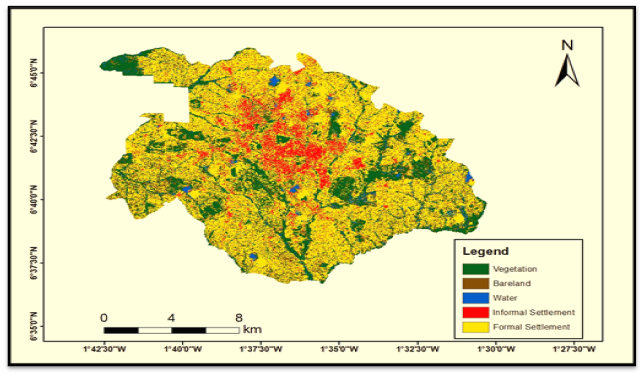
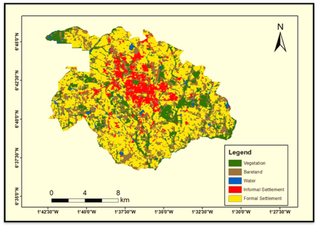

# Mapping Informal Settlements Using Machine Learning and Remote Sensing

## Project Information

**Author:**
- Courage Kumawu
  
**Supervisor:**
Dr. Yaw Mensah Asare, Kwame Nkrumah University of Science and Technology

## Overview

This project evaluates and compares pixel-based and object-based classification techniques for mapping informal settlements in Greater Kumasi using Sentinel-2 satellite imagery. The project involves applying cloud-masking and machine learning methods, specifically Random Forest, to classify the settlements. Both object-based and pixel-based techniques are utilized, and their performance metrics, such as accuracy, precision, recall, and F1-score, are computed and compared.

## Research Objectives

1. Classify informal settlements using a pixel-based classification approach.
2. Classify informal settlements using an object-based classification approach.
3. Compare and assess the accuracy of pixel-based vs object-based methods.

## Methodology

1. **Data Acquisition**: Sentinel-2 imagery is filtered and preprocessed to remove clouds and shadows using cloud-masking techniques.
2. **Object-Based Classification**: A segmentation approach using SNIC (Simple Non-Iterative Clustering) algorithm is applied, followed by classification with Random Forest.
3. **Pixel-Based Classification**: The imagery is classified pixel-by-pixel using the Random Forest classifier.
4. **Accuracy Assessment**: Confusion matrices and accuracy metrics are computed to evaluate the performance of each classification approach.
5. **Exporting Results**: The classified images and accuracy metrics are exported for further analysis.

## Results

- Object-based classification outperformed pixel-based classification in terms of overall accuracy, precision, recall, and F1-score.
   - Object-Based Accuracy: 95.70%
   - Pixel-Based Accuracy: 93.25%

## Visual Results

### Pixel-Based Classification

  

<em>Figure 1: Pixel-Based Classification of Informal Settlements in Greater Kumasi</em>

### Object-Based Classification

  

<em>Figure 2: Object-Based Classification of Informal Settlements in Greater Kumasi</em>

The images above showcase the results of our classification methods. Figure 1 displays the pixel-based classification, while Figure 2 shows the object-based classification. As evident from the visual comparison and our accuracy assessment, the object-based method (Figure 2) provides a more accurate representation of informal settlements in the Greater Kumasi area.

## Key Findings

- Object-based classification better handled the complexity and fragmentation of informal settlements.
- Pixel-based classification was less accurate, particularly in areas with mixed land use.

## Tools Used

- **Google Earth Engine**: For data processing, image classification, and accuracy assessment.
- **Random Forest Classifier**: For both object-based and pixel-based classification approaches.

## File Descriptions

- **classification_code.js**: The main code used for image classification, accuracy assessment, and export of the classified maps and accuracy metrics.
- **accuracy_measures.csv**: Contains accuracy metrics for both object-based and pixel-based classification methods.

## How to Use the Code:

1. **Clone the Repository**: Clone this repository to your local machine using:
  
2. **Open in Google Earth Engine**:

3. **Add Your Own Training Points**:
   - You need to add your own training points for classification. These can be uploaded as feature collections or drawn directly in Google Earth Engine. 
   - The training points should represent different land cover classes (e.g., informal settlements, formal settlements, vegetation, bare land, water) and be labeled with the `classes` attribute.

4. **Modify the Region of Interest (AOI)**:
   - Ensure that the `aoi` variable in the code points to your geographic area of interest. This can be a shapefile you upload or a geometry created in Google Earth Engine.

5. **Run the Code**:
   - After configuring the training points and AOI, run the code in GEE. This will perform both pixel-based and object-based classification using the Random Forest classifier.

6. **Export the Results**:
   - The classified images will be exported to your Google Drive as GeoTIFF files. You can adjust the `Export.image.toDrive` parameters (such as file name, scale, or region) as needed.

7. **Adjust Cloud-Masking Parameters (Optional)**:
   - If you're working with a different region or time period, you may want to adjust the cloud-masking thresholds (SWIR1 and SWIR2 bands) to suit the cloud conditions of your area.

---

## Exported Files

Classified images and accuracy metrics are exported as GeoTIFF and CSV files respectively, which can be visualized and analyzed further in GIS platforms.
